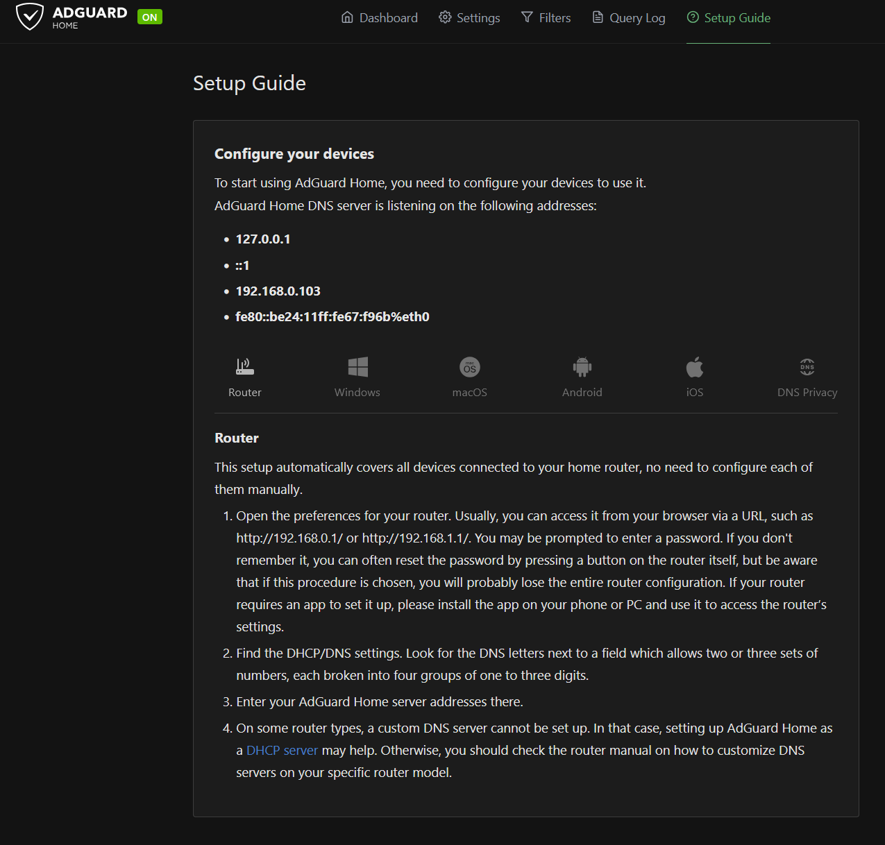
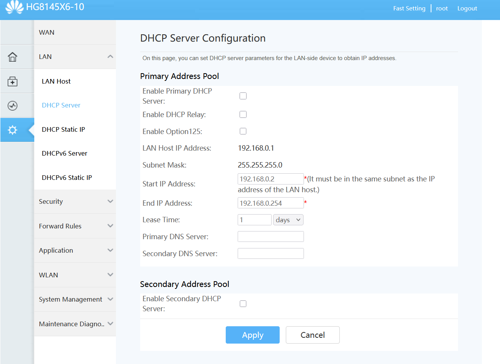
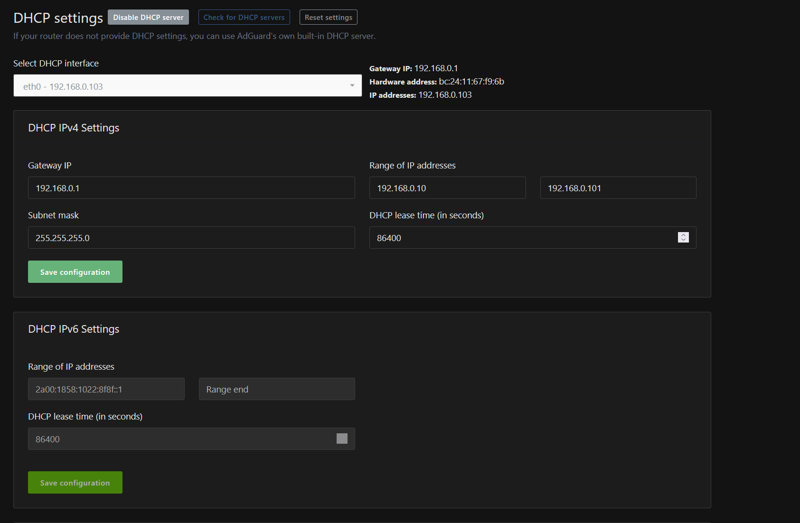
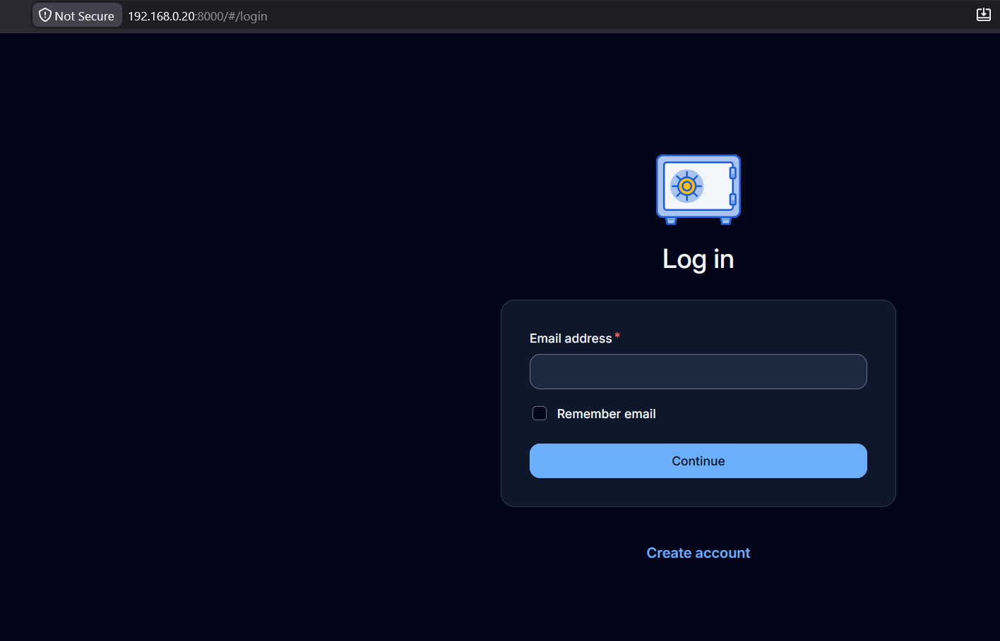
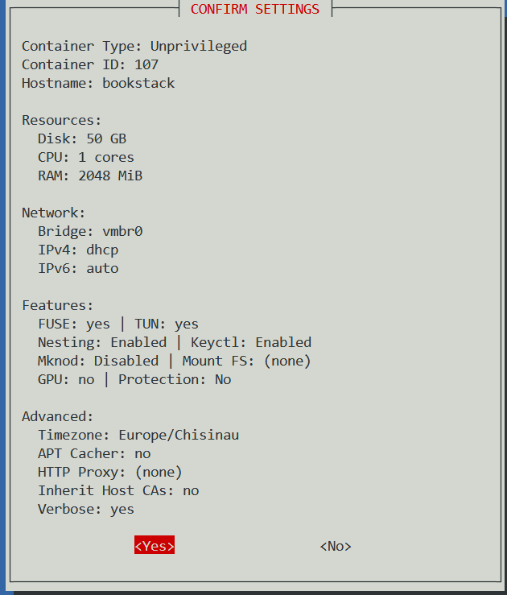
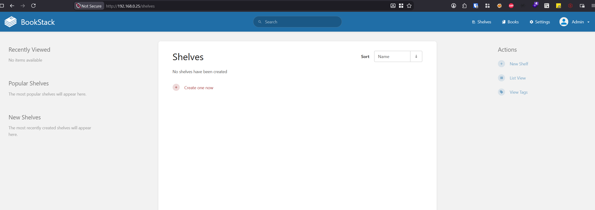
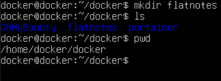
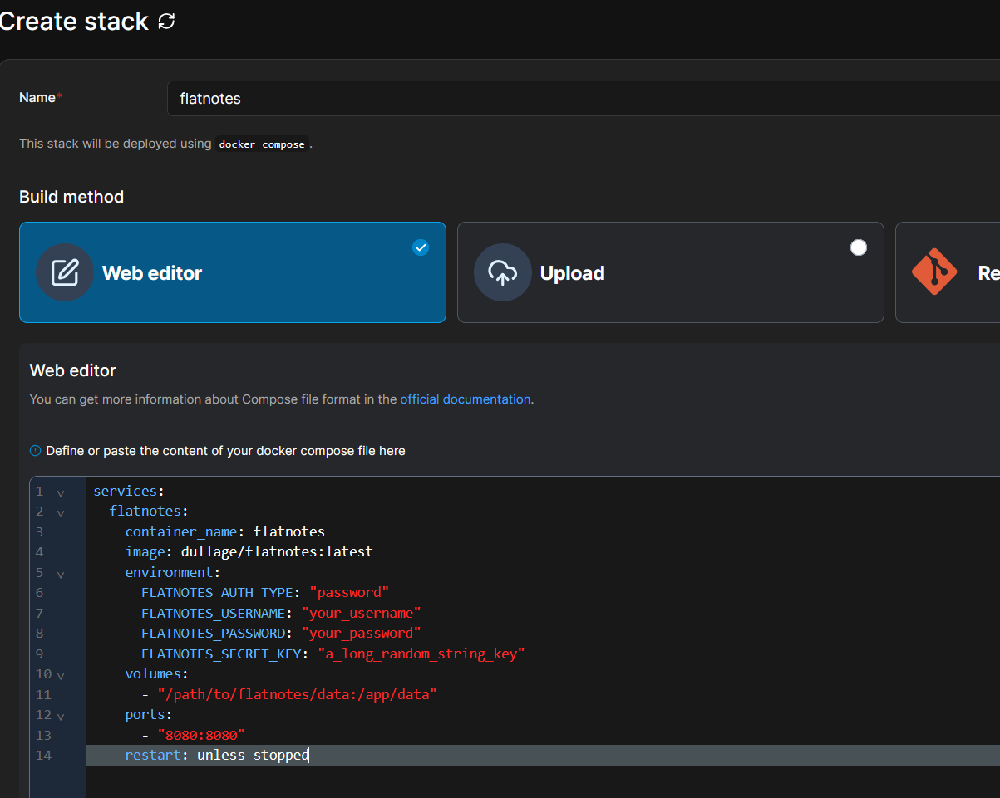
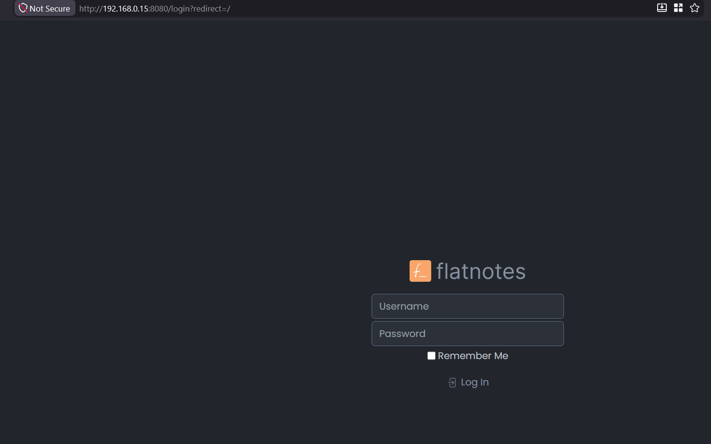

Hi, so i recently bought a homelab and I've been working on it for the past few days on what should I host and why, and here is a list of what I've accomplished self-hosting:

- Network wide ad-blocking with adguard as my DHCP server.
- Setting up docker and containers for managing services like note keeping and my own wiki page.
- Vaultwarden as a password manager.

Like I said for adblocking I used adguard, setting it up with this command:

```bash
bash -c "$(curl -fsSL https://raw.githubusercontent.com/community-scripts/ProxmoxVE/main/ct/adguard.sh)"
```

Next I navigated to the IP and setup guide to see how could i set this up on my router.



Following the Instructions I logged into my router: LAN -> DHCP server.



In the router that I own I couldn't set up primary or secondary DNS because my ISP has deliberately disabled that option. So I had to make adguard my DHCP server. I disabled DHCP in IPv4 as well as IPv6 and set up the DHCP server in adguard.



After enabling the server i noticed that not much was different, so i reset the router and run some commands on my windows machine `ipconfig /release` then `ipconfig /renew`. To confirm everything was working I ran `ipconfig /all`

```
Ethernet adapter Ethernet 2:

...

Default Gateway . . . . . . . . . : 192.168.0.1
DHCP Server . . . . . . . . . . . : 192.168.0.103
DNS Servers . . . . . . . . . . . : 192.168.0.103
```

After testing it out it worked perfectly, but there was a small catch. Soon after a website not so popular was not being reachable under the error DNS_PROBE_FINISHED_NXDOMAIN meaning that the browser couldn't resolve a domain name to an IP address. I simply changed the DNS servers from my web browser to custom -> cloudflare(1.1.1.1) and it started working fine.


Next thing I set up vaultwarden for password management. I did this by running a community script from `https://community-scripts.org`

```bash
bash -c "$(curl -fsSL https://raw.githubusercontent.com/community-scripts/ProxmoxVE/main/ct/alpine-vaultwarden.sh)"
```

Decided to go with alpine linux cause the default version was using too many resources. It quickly built everything and was ready to go.



I plan on setting this up with tailscale tailnet-only access which will make the service on the internet unreachable but reachable for a authenticated tailnet client.


Onto the next docker is going to be set up to run my own personalized tools 24/7 but also services that I will use such as **flatnotes** for note taking. To do this I created a virtual machine allocating 8GB of RAM and 4 CPU cores running on the latest version of ubuntu server minimal as of now. I installed Open-ssh and from my windows machine ssh into the virtual machine. I recommand doing it like this to not damage the host (proxmox) and have the ability of copying and pasting commands much more easily. [Here](https://www.wundertech.net/how-to-run-docker-in-proxmox-on-a-vm/) is the guide I followed to set docker up.

Going further we'll set up BookStack. A knowledge-based wiki, this will serve as my documentation on any topics that i like such as video games, cybersecurity and scientific research. We'll do this by running the community script at this [link](https://community-scripts.org/scripts/bookstack)

Chose the advanced option to configure some of the system resources, here are my settings:



navigating to the ip address and logging with default credentials we confirm that it's up and running




Next up we are going to set up flatnotes. This time we will do it through docker portainer. First we have to make a directory under docker in our ubuntu server vm.



then we are going to use the following docker-compose.yml file:

```yml
services:
  flatnotes:
    container_name: flatnotes
    image: dullage/flatnotes:latest
    environment:
      FLATNOTES_AUTH_TYPE: "password"
      FLATNOTES_USERNAME: "your_username"
      FLATNOTES_PASSWORD: "your_password"
      FLATNOTES_SECRET_KEY: "a_long_random_string_key"
    volumes:
      - "/path/to/flatnotes/data:/app/data"
    ports:
      - "8080:8080"
    restart: unless-stopped
```

set up your directory, password and everything as you like by going into your portainer instence -> Dashboard -> Stacks -> Add Stack





This is all for now. See you in the next one!