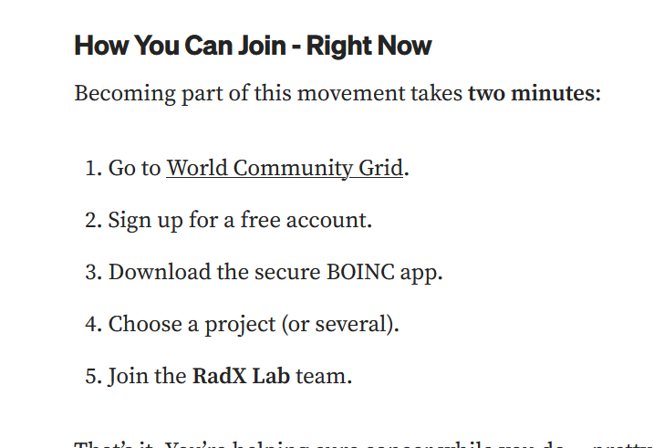
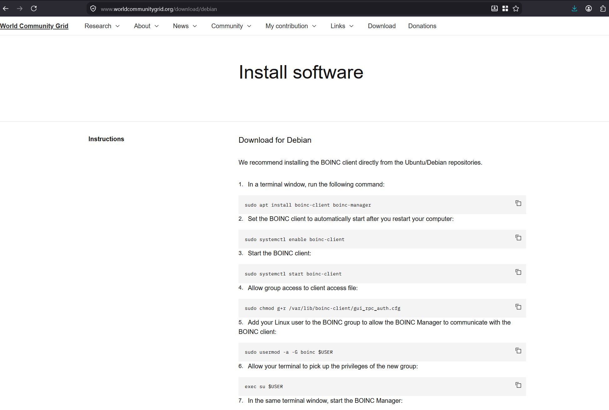
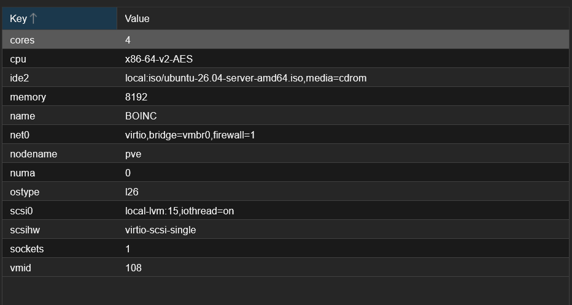
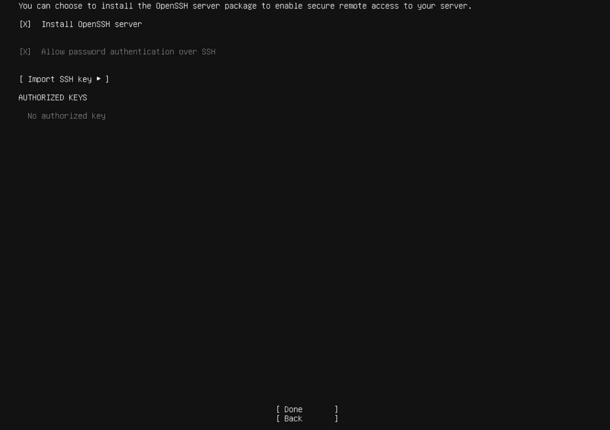
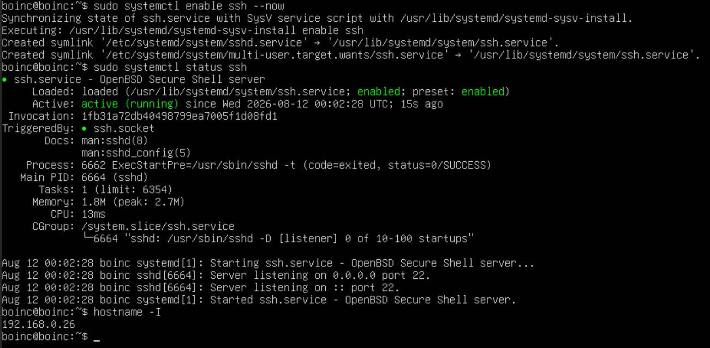
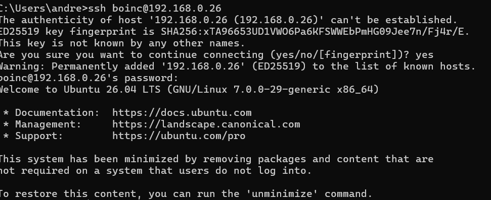
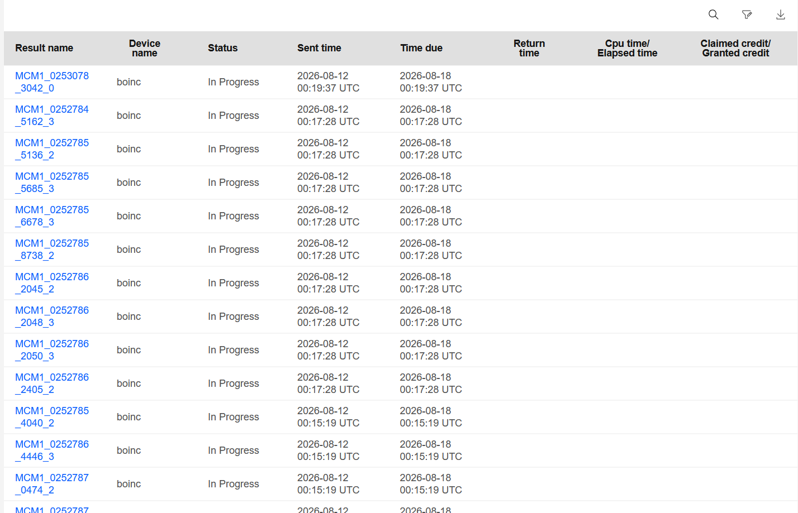
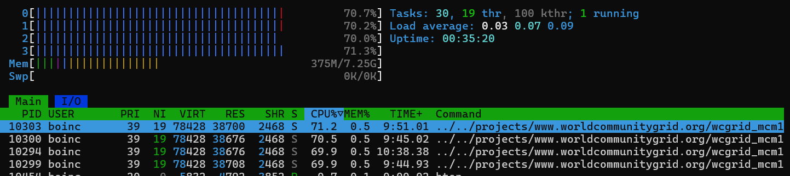

I have read [this](https://medium.com/@RadX/power-in-numbers-how-distributed-computing-helps-fight-cancer-7044bdb2708f) great article on distributed computing and how can it help in cancer research, and I decided it wouldn't hurt participating for the greater cause so I followed the steps below of setting it up.




I decided to create a virtual machine with a minimal ubuntu server instence.


Furthermore I installed Openssh with no keys since this would be a local instence reachable only on my local network so there was no need for ssh keys.



After boot I ran these commands to configure and connect to ssh from my windows machine:

```bash
sudo apt update && sudo apt upgrade -y
sudo apt-get update && sudo apt-get upgrade
sudo systemctl enable ssh --now
sudo systemctl status ssh
hostname -I
```




I encountered some problems setting up the software following the **World Community Grid** debian installation page.

```bash
sudo systemctl enable boinc-client
Synchronizing state of boinc-client.service with SysV service script with /usr/lib/systemd/systemd-sysv-install.
Executing: /usr/lib/systemd/systemd-sysv-install enable boinc-client
boinc@boinc:~$ sudo systemctl start boinc-client
boinc@boinc:~$ sudo chmod g+r /var/lib/boinc-client/gui_rpc_auth.cfg
boinc@boinc:~$ sudo usermod -a -G boinc $USER
boinc@boinc:~$ exec su $USER
Password:
boinc@boinc:~$ boincmgr -d /var/lib/boinc-client
00:06:45: Error: Unable to initialize GTK+, is DISPLAY set properly?
```

I knew the error was because i had no graphical interface, so I asked chatgpt to give me a hand on how could I set it up. I basically had to attack my account key under my Profile.

```bash
boinc@boinc:~$ boinccmd --project_attach http://www.worldcommunitygrid.org ACCOUNT_KEY
```




that's it! See ya.