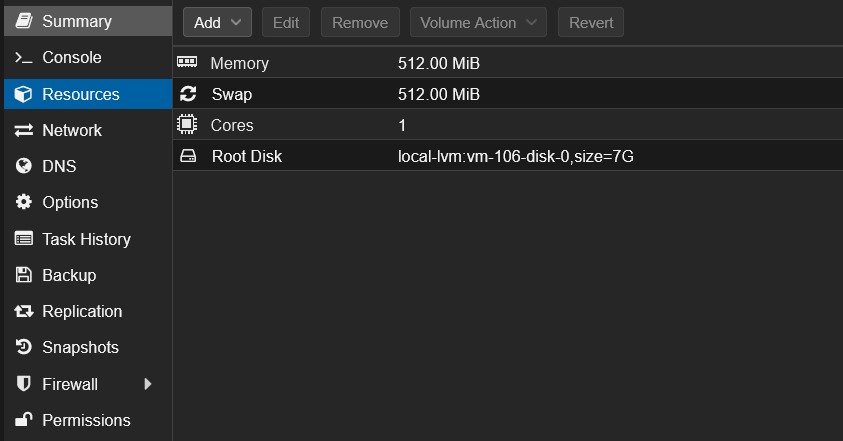
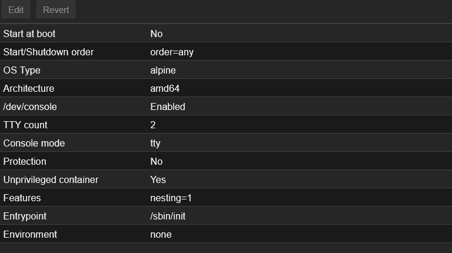
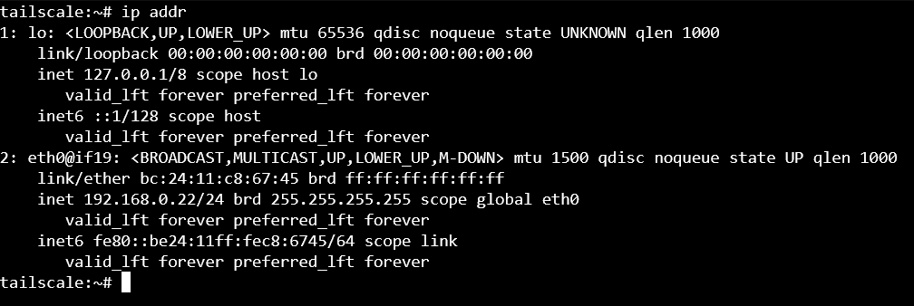
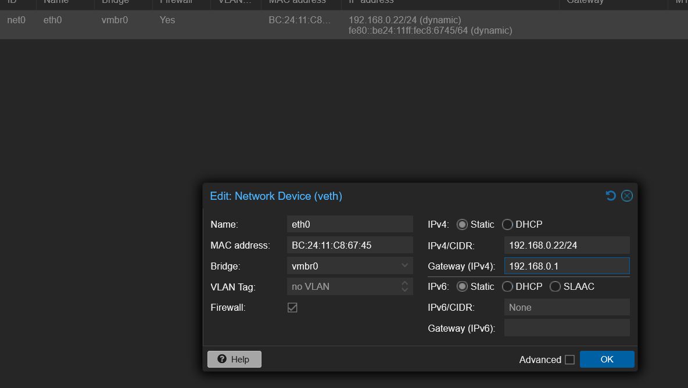
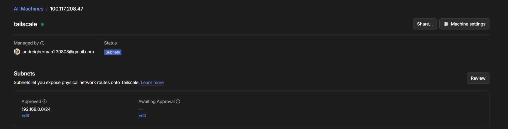

Hi. Today we are going to set up tailscale on a tailnet network to be able to manage my proxmox server from anywhere in the world with an authenticated instence of tailscale unreachable over the internet.

For this we are going to create a LXC container as it's much resource friendly and we don't need a dedicated machine for a lightweight service like tailscale.





Let's set set this container to have a static IP for reliability and in case anything goes wrong.



To set up tailscale we are going to run these commands

```bash
apk upgrade --update-cache
apk add tailscale
```

Enable tailscale to start on boot and start tailscale:

```bash
rc-update add tailscale default
rc-service tailscale start
```

Something was wrong when running `tailscale up`. Upon more investigation i came across thi article: [Setting up taiscale in XLC containers.](https://tailscale.com/docs/features/containers/lxc/lxc-unprivileged)

So I set up device passthrough and rebooted the system. Upon boot I ran these commands to get tailscale up and running:

```bash
rc-service tailscale start
rc-service tailscale status
tailscale up
```

After that I enabled IPv4 forwarding on my lxc:

```bash
sysctl -w net.ipv4.ip_forward=1
```

then advertised my LAN:

```bash
tailscale set --advertise-routes=192.168.0.0/24
```

Go to your tailscale admin console and on Subnets move the awaiting approval to aprroved:



