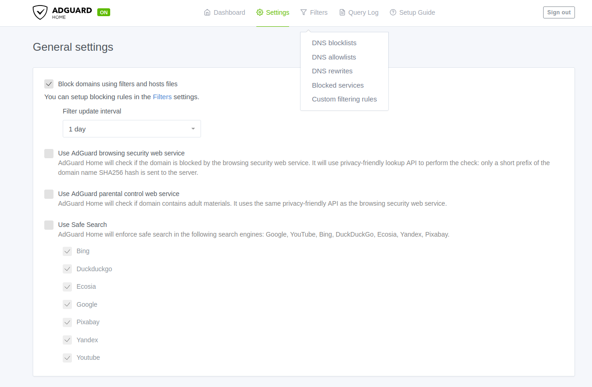
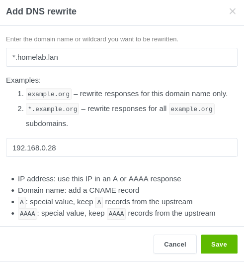
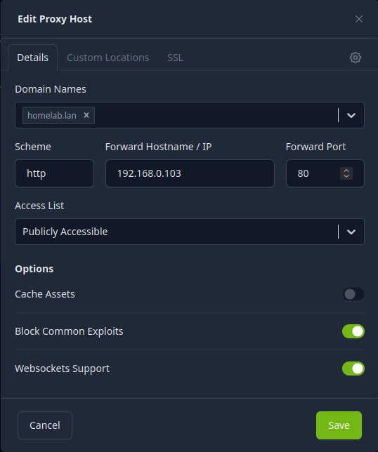
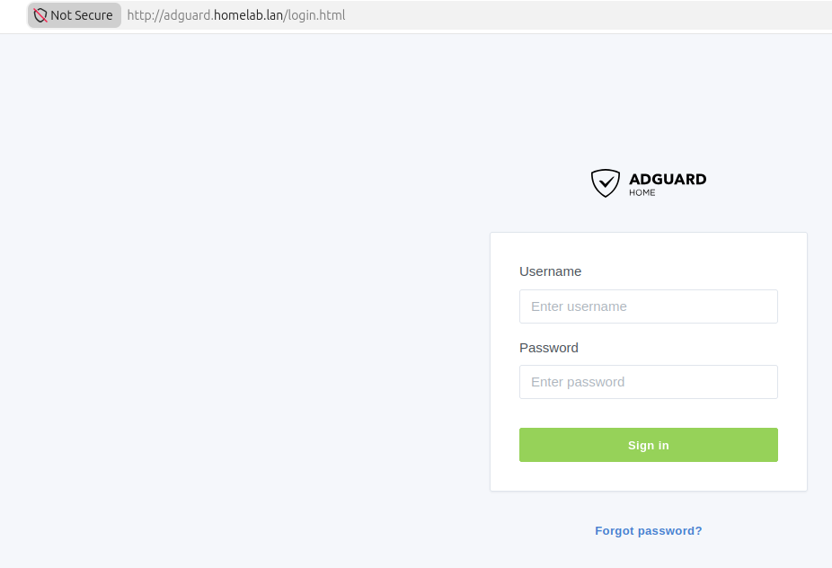
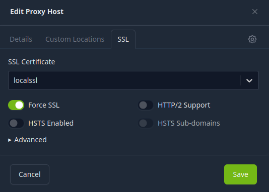
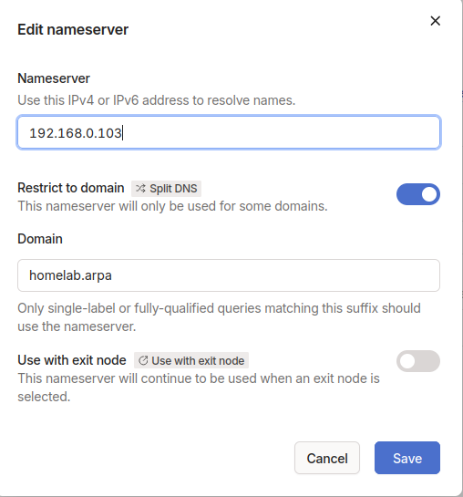

What is split DNS?

Split DNS (or split horizon DNS) is a DNS configuration that provides different IP addresses for the same domain name depending on where the DNS request comes from, such as giving internal users a private IP and external users a public IP.
DNS is just the protocol for turning a IP address into a website easy to remember. Split DNS makes that easier because of the software that we will use to automatically get rid of those annoying SSL errors and be able to access our homelab services either on the internet or on our tailnet easily.

For this we are going to set up something called a reverse proxy like **nginx reverse proxy** and set up SSL certificates within nginx. For the installation we will use a community script which will make everything a lot more easier even tho we could set this up from scratch with a bunch of commands but there's no need to.

```bash
var_cpu="1" var_ram="1024" var_disk="12" bash -c "$(curl -fsSL https://raw.githubusercontent.com/community-scripts/ProxmoxVE/main/ct/nginxproxymanager.sh)"
```

I am running adguard home, so I will go to my DNS rewrites to set the domain to something like `homelab.lan` because `.lan` is not a real domain extension reachable over the internet and thus only when I am connected to my tailnet. After I can buy some domains on cloudflare and configure them with the ip of nginx. I might update the blog if I feel like it but taking into considerations i will probably not have more then 3 srvices exposed out on the internet because the internet is a scary place with scary people i don't really see the point in doing so when there are thousands of videos on how you can configure cloudflare with your proxy resolver.

Leaving all of it aside here I managed to configure the homelab.lan domain:





We'll add a proxy host by going to our nginx instence and `Hosts -> Proxy Hosts` 



and then I just added the adguard host for the same settings just changing it to `home.homelab.lan` and it worked perfectly.



Now I need to make a SSL certificate for my services to use. You do this by running this command on your linux instence (not in your homelab)

```bash
openssl req -x509 -nodes -days 365 -newkey rsa:2048 -keyout server.key -out server.crt
```

Next in NPM go to certificated and put in the name and the server key alongside the .crt file, after that you will have a custom certificate. Go to `proxy hosts -> SSL` and import your custom SSL certificate just like this:



By the way, if you're using something like a VPN mesh, if you're doing all of this locally configure it in the VPN DNS settings. For me it's tailscale and I configured it in that and it should be working for you if it worked for me.



That's all. See ya!