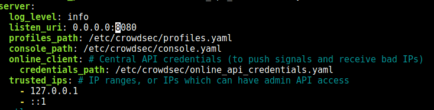
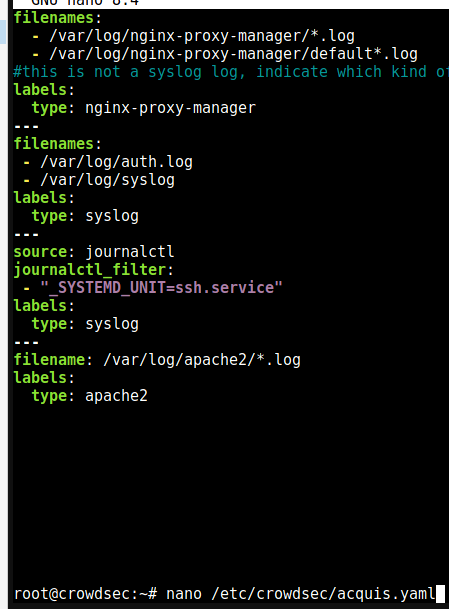
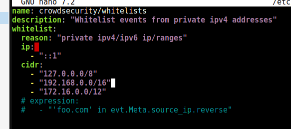
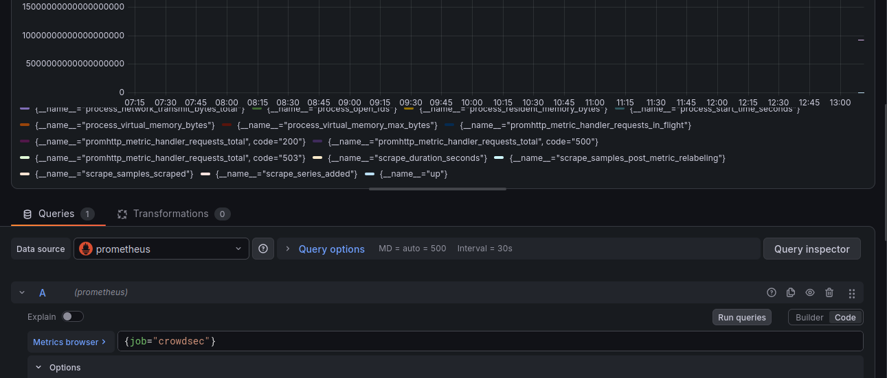
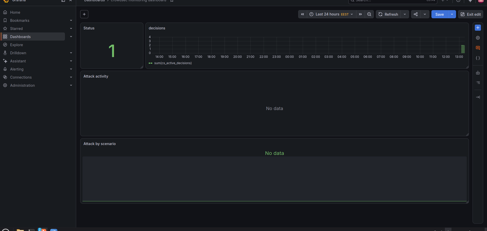

Hi. In this article I will present how I've set up my security monitoring stack for blocking IP addresses of melicious attackes. It serves a purpose when you want to deploy a certains service to the internet and you don't want someone trying to break in or DDoS your network. For this I have set up **nginx proxy manager (NPM)** and I'll be setting up **crowdsec** as the monitoring.

Firstly, I'll add a bind mount pointing to the NPM log folder:

```bash
nano /etc/pve/lxc/NPM_ID.conf
```

After you can add this line to the config of your NPM instence:

```
mp0: /var/lib/pve/shared-logs/npm,mp=/data/logs
```

You'll want crowdsec reading your NPM logs, so we're going to mount the same host directory into CrowdSec as a read-only share. You'll have to add this line at the end of your crowdsec config:

```
mp0: /var/lib/pve/shared-logs/npm,mp=/var/log/nginx-proxy-manager,ro=1
```

Next just installing crowdsec and nginx parsing collection:

```
curl -s https://install.crowdsec.net | sh
apt-get install crowdsec -y
cscli collections install crowdsecurity/nginx-proxy-manager
```

next in your `/etc/crowdsec/config.yml` configure crowdsec to listen on all interfaces:



Now we're going to need to tell crowdsec where to look for the shared NPM logs. This is done by editing the acquisition file:



restart the service and add the bouncer (the bouncer is the thing that will block ip addresses)

```bash
systemctl restart crowdsec
apt-get install crowdsec-firewall-bouncer-nftables -y
```

Next we are going to whitelist our local network so we don't get blocked by the bouncer.

```bash
ls /etc/crowdsec/parsers/s02-enrich/
```

```
dateparse-enrich.yaml  geoip-enrich.yaml  http-logs.yaml  public-dns-allowlist.yaml  whitelists.yaml
```



looks good. Now my goal was to integrate this with prometheus + grafana so when an attacker tries to brute-force one of my login pages i can visualize it in grafana.

I just changed my config at the end to listen on my LAN IP of the crowdsec machine, restart the service and in my docker VM added this to my prometheus config:

```yml
scrape_configs:
  - job_name: crowdsec
    static_configs:
      - targets:
          - '192.168.0.33:6060'
```

did a docker restart, went to grafana and verfied if it works and it did! Now i just had to configure it.





There are not exposed services to the internet at the moment so that's why everything is so empty. I will set this up with a notification alerting system so when I get a chain of attacks I can act quickly. Till then goodbye!